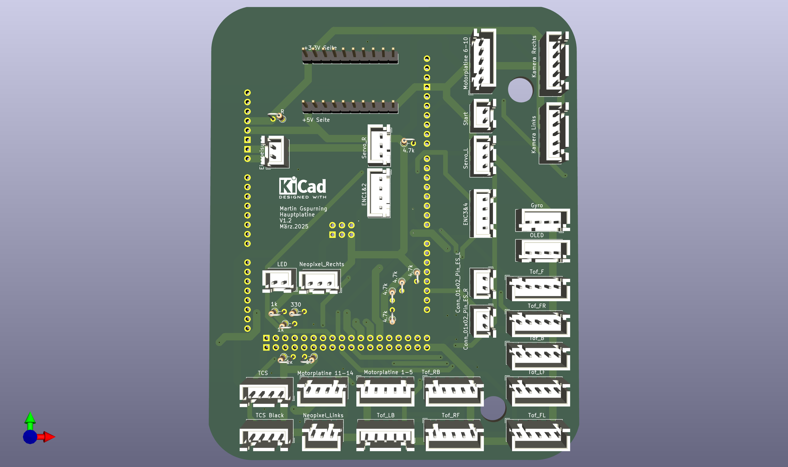
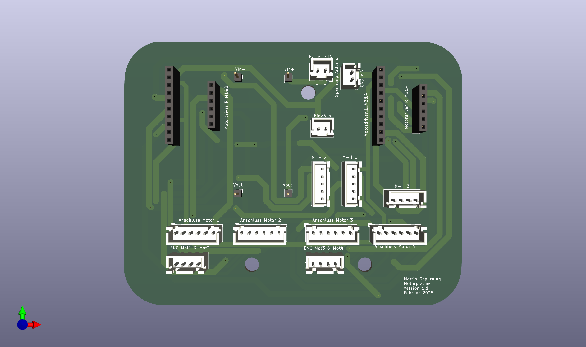

# Rendering

## CAD

The robot was designed using Autodesk Fusion. I created STEP files from the PCBs in KiCad and then imported them into Fusion, making it much easier to design the robot.  
All the files can be found in the repository under [CAD](https://github.com/Gwynspring/RescueMaze/tree/main/CAD).

## PCB

The PCBs were designed using KiCad, and the schematics as well as the `.pcb` files can be found in the repository under [PCB](https://github.com/Gwynspring/RescueMaze/tree/main/PCB).

### Main PCB

### PCB for Voltage Conversion and Motor Drivers

