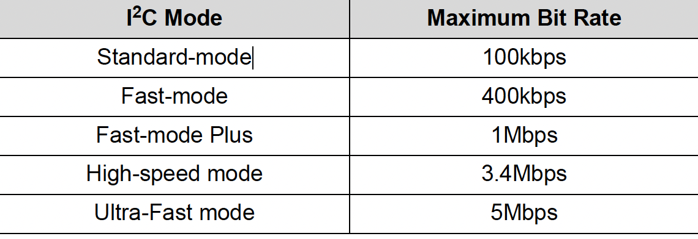
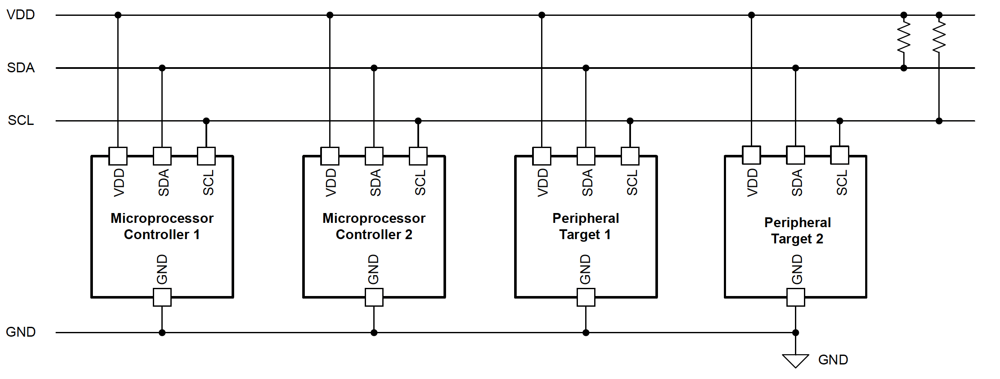
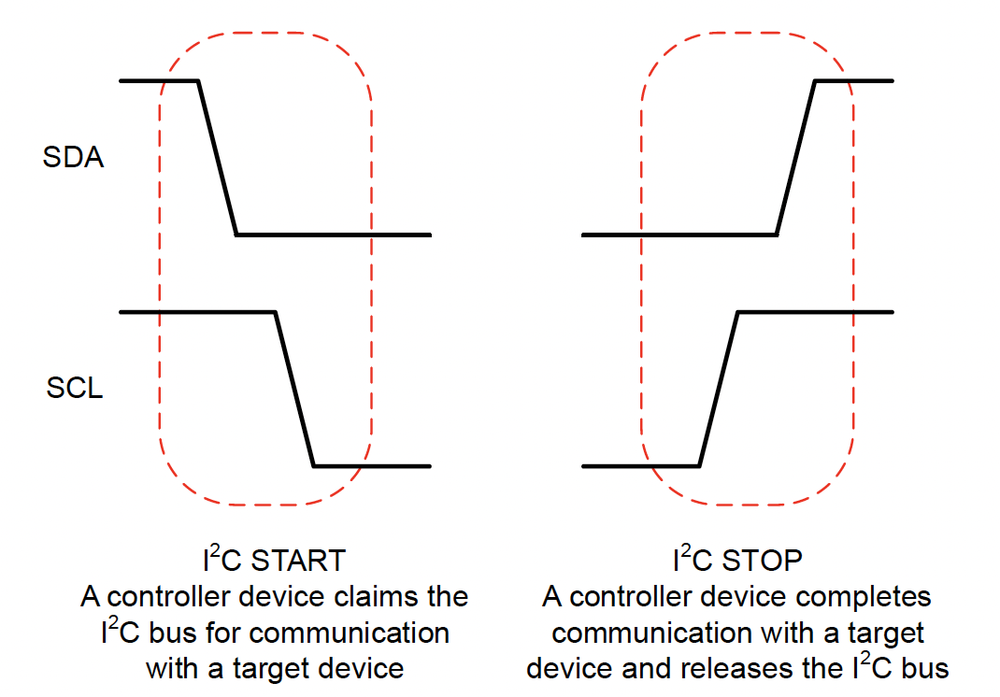
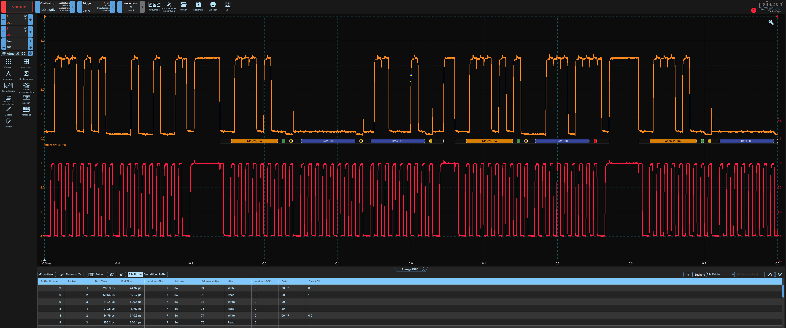
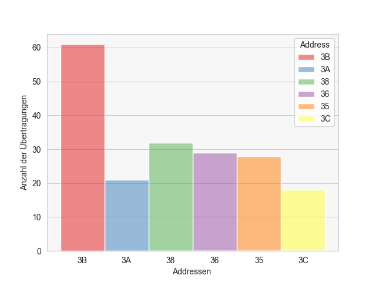
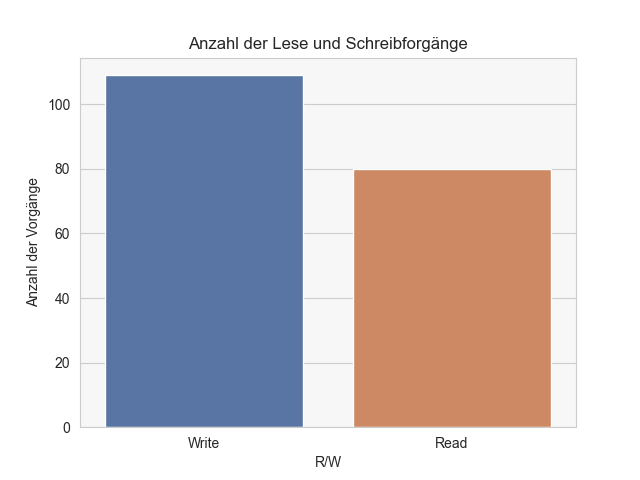

# I²C Kommunikation

## 1. Aufgabenstellung

- Gewinnung des Messsignals
- Festlegung der Struktur der Messeinrichtung
- Bestimmung der Signalformen
- Übertragung und Verarbeitung der Messsignale
- Ausgabe und Darstellung der gewonnenen Informationen

## 2. Theoretische Grundlagen

I²C ist ein Kommunikationsprotokoll, das zwei Leitungen – _Serial Data Line (SDA)_ und _Serial Clock Line (SCL)_ – verwendet. 
Das Protokoll ermöglicht die Kommunikation zwischen mehreren Geräten, bei der jedes Gerät eine eindeutige Adresse hat. 
Es unterstützt die Übertragung von Daten in Form von Byte-Paketen.

### Geschwindigkeitsmodi

I²C-Kommunikation kann in den folgenden drei Modi erfolgen:

- **Standardmode (Sm):** 100 kbit/s
- **Fastmode (Fm):** 400 kbit/s
- **Fastmode Plus (Fm+):** 1 Mbit/s

**Abb. 1.1:** Gegenüberstellung der Geschwindigkeitsmodi


Quelle: Wu, Joseph, 2022, S.3
### Aufbau des I²C-Bus

**Abb. 1.2:** Schematischer Aufbau eines I²C Bussystems



(vgl. ebd.,S.4, Figure 2-1)

### SCL (Serial Clock)

Die SCL-Leitung ist für den Takt der Kommunikation verantwortlich und wird vom Master gesteuert. Sie gibt den Rhythmus für die Datenübertragung vor.

### SDA (Serial Data)

Die SDA-Leitung überträgt die eigentlichen Daten zwischen den Geräten. Ein Controller kann Ausgabewerte an einen DAC senden oder Daten von einem ADC empfangen.

### Halbduplex vs. Vollduplex

I²C ist ein halbduplexes Kommunikationsprotokoll, bei dem Daten nur in eine Richtung gleichzeitig fließen können. Im Gegensatz dazu ist SPI ein vollduplexes Protokoll, das gleichzeitige Datenübertragungen in beide Richtungen ermöglicht.

**Vorteile von I²C:**

- Geringer Verdrahtungsaufwand
- Weniger benötigte Pins am Mikrocontroller

### I²C Adressierung und Busstruktur

Der I²C-Bus nutzt eine Master-Slave-Struktur, wobei der Master die Kommunikation initiiert und steuert. Jedes Gerät auf dem Bus hat eine eindeutige Adresse, die es ihm ermöglicht, mit anderen Geräten zu kommunizieren. Die SDA- und SCL-Leitungen sind mit allen Geräten auf dem Bus über Open-Drain-Verbindungen verbunden, was Pull-up-Widerstände erfordert.

### I²C Start- und Stoppbedingungen

Die Kommunikation wird mit einer **START-Bedingung** eingeleitet, wobei der Master die SDA-Leitung auf Low und dann die SCL-Leitung auf Low zieht. Die Kommunikation endet mit einer **STOP-Bedingung**, bei der beide Leitungen auf High gesetzt werden, um den Bus freizugeben.

**Abb. 1.3:** Start- und Stoppvorgang der Kommunikation


(vgl. ebd.,S.7, Figure 3-1)

## 3. Bauelementdaten

Verwendete Bauteile:

- 2x VL53L0X
- 2x VL53L1X
- 3x VL6180
- 2x TCS3472 RGB Sensor
- L3GD20H Gyrosensor
- OLED Display 0,96 Zoll

## 4. Messung mit dem Oszilloskop

**Abb. 2.3:** Versuchsaufbau


**Abb. 2.4:** Detailansicht der Messspitzen


**Abb. 2.5:** Ausschnitt einer Messung der I²C-Kommunikation mit dem Oszilloskop



## 5. Messergebnisse und Programmierung

### Pandas

Das **Pandas**-Framework wird verwendet, um die `.csv`-Datei zu importieren, die aus der PicoScope7-Software exportiert wurde. Diese Datei enthält 64 Buffer-Nummern und zeigt die Kommunikation zwischen dem Arduino Mega und den verwendeten Sensoren. Pandas erleichtert die Anzeige und Analyse der Daten.

### Seaborn

Für die Analyse und Visualisierung der Daten wurde **Seaborn**, eine auf **Matplotlib** basierende Python-Bibliothek, verwendet. Seaborn bietet eine benutzerfreundliche Schnittstelle für das Erstellen attraktiver und informativer statistischer Grafiken.





```python
import pandas as pd
import matplotlib.pyplot as plt
import seaborn as sns

# CSV-Datei laden
df = pd.read_csv("/path/to/your/file.csv")

# Überprüfen auf fehlende Werte
print(df.isna())
print(df.dropna())

# Farbschema festlegen
cmap = plt.get_cmap('viridis')

# Histogramm der I²C-Adressen
sns.histplot(data=df, x="Address", hue='Address', palette='Set1')
plt.grid(True, axis='x', linestyle='')
plt.xlabel("Adressen")
plt.ylabel("Anzahl der Übertragungen")
sns.set_style('whitegrid')
plt.gca().set_facecolor('#F7F7F7')

# Speichern und Anzeigen des Diagramms
plt.savefig("/path/to/save/directory/I2C_MimsRC_Decoding")
plt.show()

# Anzahl der Lese- und Schreibvorgänge
plt.title("Anzahl der Lese- und Schreibvorgänge")
sns.barplot(data=df["R/W"].value_counts(), palette="deep")
sns.set_style('whitegrid')
plt.gca().set_facecolor('#F7F7F7')
plt.ylabel("Anzahl der Vorgänge")

# Speichern und Anzeigen des Diagramms
plt.savefig("/path/to/save/directory/I2C_MimsRC_R_W")
plt.show()

# Berechnung der Zeitdifferenz
df['Time'] = df["End Time"] - df["Start Time"]
print(df['Time'])

# Gesamtdauer der Messung
duration = df['Time'].sum()
print(f'Länge der Messung: {duration * 1000} ms')

```
