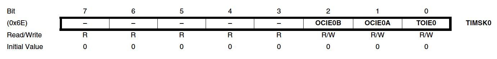
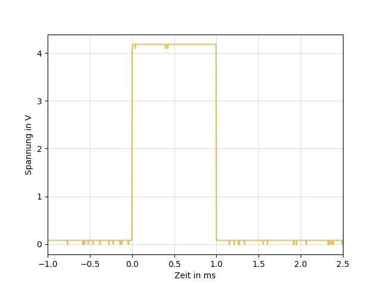

# Timer/Counter0 für die Pulsweitenmodulation mit dem Atmega2560

## 1. Übersicht

Der **Timer/Counter0** ist ein 8-Bit-Zählermodul mit zwei unabhängigen Vergleichseinheiten und Unterstützung für die Pulsweitenmodulation (PWM). Diese Funktion ermöglicht die präzise Steuerung eines generierten Signals.  
Das folgende Blockdiagramm illustriert den Ablauf:

**Abb. 1.1**: Blockdiagramm

Quelle: ATmega Datenblatt, 2014, S.115, Figure 16-1

## 2. Register Überblick

Die wichtigsten Register sind:

- **TCNT0** (Timer/Counter)
- **OCR0A** und **OCR0B** (Output Compare Register)

Diese 8-Bit-Register können individuell programmiert werden. Interrupts werden über das **Timer Interrupt Mask Register (TIMSK0)** konfiguriert.

Der Timer/Counter kann mit dem internen Mikrokontroller-Takt oder einem externen Taktgeber am Pin **T0** betrieben werden. Bei Nutzung des internen Takts kann der Prescaler im Register **TCCR0B** angepasst werden, um die Timer-Frequenz zu skalieren. Die Berechnung wird später genauer erläutert.

Die **OCR0A**- und **OCR0B**-Register werden fortlaufend mit dem Zählerwert verglichen. Das Ergebnis dieses Vergleichs kann zur Signalerzeugung genutzt werden.

## 3. Detaillierte Registeranalyse für PWM

### 3.1. _TCCR0A_

Im **TCCR0A**-Register wird das Bit **WGM01** gesetzt, um den Timer in den **Clear Timer on Compare Match (CTC)**-Modus zu versetzen. In diesem Modus zählt der Timer bis zu einem definierten Wert und wird anschließend zurückgesetzt.

**Abb. 3.1**: TCCR0A

(vgl. ebd.,S.126)

### 3.2. _TCCR0B_

Im **TCCR0B**-Register wird das Bit **CS01** gesetzt, um den CPU-Takt mit einem Prescaler von 8 zu verwenden.

**Abb. 3.2**: TCCR0B

(vgl. ebd.,S.129)

### 3.3. _OCR0A_

#### 3.3.1. Funktion

Das **OCR0A**-Register enthält einen 8-Bit-Wert, der mit dem Zähler verglichen wird. Bei Übereinstimmung kann ein Interrupt ausgelöst werden, der zur PWM genutzt wird. Mit einem Prescaler von 8 wird alle 100 $µs$ ein Interrupt generiert.

**Abb. 3.3**: OCR0A

(vgl. ebd.,S.130)

#### 3.3.2. Berechnung des Vergleichswertes

Das Ziel ist eine PWM mit 20 $Hz$ für Servomotoren. Die Timer-Frequenz ergibt sich aus dem CPU-Takt und dem Prescaler:

$$
f_{\text{timertick}} = \frac{16 \cdot 10^6 \, \text{Hz}}{8} = 2 \cdot 10^6 \, \text{Hz}
$$

Ein Timerimpuls wird alle 0,1 $ms$ benötigt:

$$
\text{ticks}(x) = f\_{\text{timertick}} \cdot x = 2 \cdot 10^6 \, \text{Hz} \cdot (0.1 \cdot 10^{-3}) \, \text{s} = 200
$$

Der Vergleichswert ergibt sich zu:

$$
OCR0A = \text{ticks}(x) - 1 = 199
$$

### 3.4. _TIMSK0_

Im **TIMSK0**-Register wird das Bit **OCIE0A** gesetzt, um den Timer0-Interrupt bei einem Compare-Match zu aktivieren.

**Abb. 3.4**: TIMSK0

(vgl. ebd.,S.131)


## 5. Versuchsaufbau
**Abb. 5.1**: Messung der Pulsweitenmodulation für einen Servomotor


## 4. Grafische Darstellung der PWM

Der modulierte Signalverlauf über 3,5 $ms$ zeigt unterschiedliche Pulsweiten, die zur Servomotorsteuerung genutzt werden.

### Positionen des Servomotors:

- **0°**: 500 $µs$
- **90°**: 1450 $µs$
- **180°**: 2400 $µs$

**Abb. 4.1**: Signal mit 1ms Pulsweite


**Abb. 4.2**: Signal mit 2ms Pulsweite


## 5. Frequenzanalyse des PWM-Signals

### 5.1. Sampling-Frequenz und Auflösung

- Die Sampling-Frequenz $f_s = 3,13 MS/s$ erfüllt das Nyquist-Theorem:
  $$
  f_s > 2 \cdot f_{\text{signal}}
  $$

### 5.2. Spektrumverteilung

- Stark gedämpft im höheren Frequenzbereich ($< -60 dB$).

### 5.3. Charakteristische Frequenzkomponenten

- Dominante Grundfrequenz sichtbar bei niedriger Frequenz.

### 5.4. Rauschkomponenten

- Hohes Grundrauschen, besonders bei Frequenzen > 0.5 MHz.

**Abb. 5.1** Analyse der Frequenzen


## 6. Programmierung der Pulsweitenmodulation

```cpp
#include "RS232.h"
#include "ADU_ATMEGA2560 V21.h"
#include <avr/io.h>
#include <avr/interrupt.h>
#include <util/delay.h>
#include <Arduino.h>

#define SERVO_1_PIN PE5
#define SERVO_1_DDR DDRE
#define SERVO_1_PORT PORTE
#define SERVO_2_PIN PG5
#define SERVO_2_DDR DDRG
#define SERVO_2_PORT PORTG

volatile uint8_t pulse_length_servo1 = 15;
volatile uint8_t pulse_length_servo2 = 15;
volatile bool move_to_180 = true;

void setup()
{
    TCCR0A = (1 << WGM01);
    TCCR0B = (1 << CS01);
    OCR0A = 199;
    TIMSK0 = (1 << OCIE0A);

    SERVO_1_DDR |= (1 << SERVO_1_PIN);
    SERVO_2_DDR |= (1 << SERVO_2_PIN);

    sei();

    ADU_Init();
    RS232_Init(RS232_NUR_EMPFANGEN);
}

void loop()
{
    if (Empfangen == 'u')
    {
        if (move_to_180)
        {
            pulse_length_servo1 = 24;
            pulse_length_servo2 = 24;
        }
        else
        {
            pulse_length_servo1 = 5;
            pulse_length_servo2 = 5;
        }

        move_to_180 = !move_to_180;
        Empfangen = 0;
    }
}

ISR(TIMER0_COMPA_vect)
{
    static uint8_t counter = 0;

    if (counter == 0)
    {
        SERVO_1_PORT |= (1 << SERVO_1_PIN);
        SERVO_2_PORT |= (1 << SERVO_2_PIN);
    }

    if (counter == pulse_length_servo1)
    {
        SERVO_1_PORT &= ~(1 << SERVO_1_PIN);
    }
    if (counter == pulse_length_servo2)
    {
        SERVO_2_PORT &= ~(1 << SERVO_2_PIN);
    }

    counter++;
    if (counter >= 200)
    {
        counter = 0;
    }
}
```
