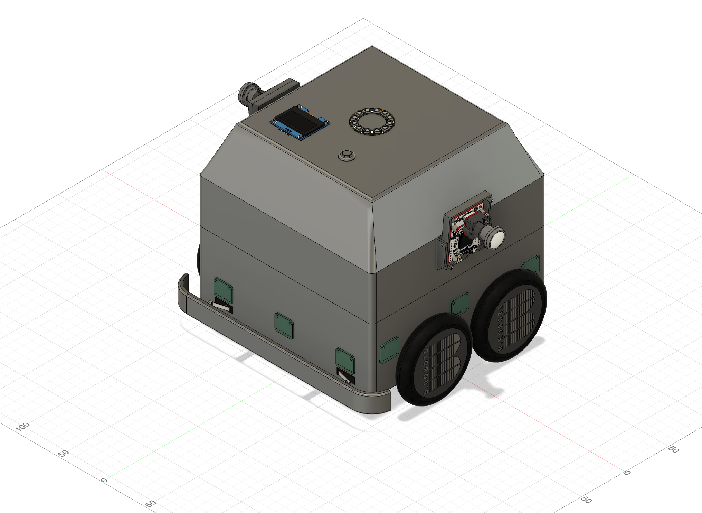

# 3D-Model

The robot was designed using Autodesk Fusion. I created STEP files from the PCBs in KiCad and then imported them into Fusion, making it much easier to design the robot.  
All the files can be found in the repository under [CAD](https://github.com/Gwynspring/RescueMaze/tree/main/CAD).

