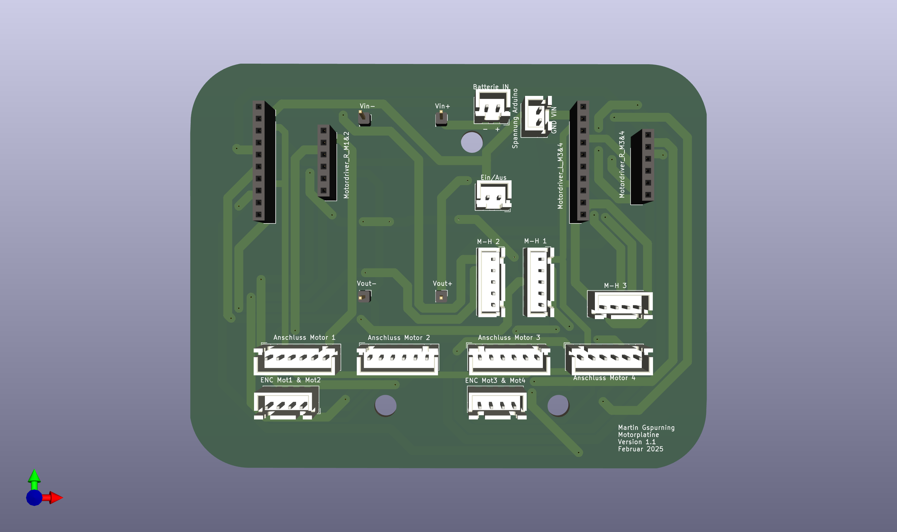

# PCB

The PCBs were designed using KiCad, and the schematics as well as the PCB files can be found in the repository under [PCB](https://github.com/Gwynspring/RescueMaze/tree/main/PCB).
Because of the robust and flexible usage of the JST connection system, I tried to use as many JST connections as possible.
The `Arduino Mega2560` sits on the backside of the PCB and can be mounted on the robot case.

## Main PCB

## Voltage Conversion and Motor Drivers

For easier replacement and usage, the two `Adafruit TB6612FNG` motor drivers are mounted with pins instead of being soldered directly onto the PCB.

